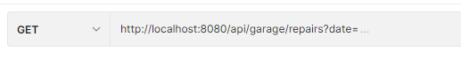

## Autogarage

Welkom bij mijn eindproject van Hogeschool Novi. Het project is een resultaat van de geleerde stof uit het "Full-Stack
Developer" curriculum. Binnen dit project heb ik de backend van een autogarage ontworpen. Hierin kan het proces van
keuringen en reparaties rondom auto's en klanten worden nagebootst. Het bevat al vooraf bepaalde data voor o.a. klanten,
auto's, keuringen, facturen en reparaties. Natuurlijk is het ook mogelijk om de applicatie van nieuwe date entries te
voorzien. Binnen deze applicatie is er ook authenticatie en autorisatie toegepast.

## Inhoudsopgave

* [Installatie](#Installatie)
    + [Rollen en users](#Rollen-en-users)

* [Endpoints](#endpoints)
    + [Appointments](#Appointments)
    + [Autorisatie](#Autorisatie)
    + [Assignments](#Assignments)
    + [Cars](#cars)
    + [Customers](#customers)
    + [Inventory](#Inventory)
    + [Inspections](#Inspections)
    + [Invoices](#Invoices)
    + [Registration papers](#Registration-papers)
    + [Repairs](#Repairs)
    + [Repair items](#Repair-items)
    + [Users](#Users)

## Installatie

1. Download en installeer PostgresSQL via onderstaande URL. De applicatie maakt gebruik van deze database.

> https://www.postgresql.org/download/

2. Installeer de IntelliJ IDE indien dit nog niet gedaan is.

3. Installeer Postman voor op de pc via onderstaande link. Voorbeelden van alle Postman collections zijn toegevoegd in
   de resource folder.

> https://www.postman.com/downloads/

4. Clone het project in IntelliJ via onderstaande link van mijn repository of download het zipp-bestand en open het via
   File → new → project from existing source en klik op het pom bestand uit de zipp-file.

> https://github.com/JasperKrol/Eindproject-Garage

5. In dit project is onderstaande configuratie gebruikt voor PostgreSQL.<br/>
   server.port=8081</br>
   spring.datasource.url=jdbc:postgresql://localhost:5432/garage<br/>
   spring.datasource.username=postgres<br/>
   spring.datasource.password=Welkom123<br/>

   Wil je een andere configuratie gebruiken, dan pas je dit aan in het **application.properties** bestand.

6. Cross-Origin is aangezet voor alle endpoints.

7. Authorization verplicht (JWT token). Zie onderwerp endpoints enkele alinea's hieronder.

8. Run het project via het groene pijltje in de rechterbovenhoek van IntelliJ.

#### Rollen en users

Deze rollen kunnen gebruikt worden voor de beoordeling en het testen van de applicatie. De verschillende rollen hebben
toegang tot hun eigen endpoints. Deze staan in de meest rechter kolom.

| Username                  | Password | Role                     | Endpoints authorization                            |
|---------------------------|----------|--------------------------|----------------------------------------------------|
| Henk                      | password | MONTEUR                  | Get.customers, Get.cars,inventory**, inspections** |
|                           |          |                          | repair_items**, invoices**                         |
| Peter                     | password | MONTEUR                  | Get.customers, Get.cars, inventory**, inspections**|
|                           |          |                          | repair_items**, invoices**                         |
| Jasper                    | password | ADMIN                    | Alles als admin                                    |
| Pien                      | password | OFFICE                   | invoices**, customers**, cars**, inspections**     |
|                           |          |                          | repairs**, registration_papers**, appointments**   |

<br>

## Endpoints

Hieronder vind u alle endpoints die de applicatie bevat. Deze kunnen benaderd worden via postman en werken via het
MVC-model. De authenticatie van de applicatie werkt met een Bearer token. Deze token moet mee gegeven worden aan elk
request. Dit doe je in Postman door onder Authorization, Bearer Token in te stellen en de token in te vullen.

De token verkrijg je door eerst het Authorization endpoint uit te voeren. De token is vervolgens 10 dagen geldig.

#### Autorisatie

* POST /api/v1/authenticate
  <br/><br/>
  In de body geef je de username en password mee. Hiervoor kan een user uit bovenstaande tabel gebruikt worden:

Voorbeeld:

```json
{
  "username": "jasper",
  "password": "password"
}
```

#### Appointments

> **_NOTE:_**
Optioneel parameter: 'status' <br/> voorbeeld: appointments?status=REPARATIE_KLAAR <br/>
> 

* {PUT [/api/garage/appointments/{id}]}
* {PUT [/api/garage/appointments/{id}/car]}
* {POST [/api/garage/appointments]}
* {GET [/api/garage/appointments]}
* {GET [/api/garage/appointments/{id}]}
* {DELETE [/api/garage/appointments/{id}]}

#### Authorization+Authentication

* {POST [/authenticate]}

#### Cars

* {PUT [/api/garage/cars/{id}]}
* {PUT [/api/garage/cars/{id}/registrationpaper]}
* {POST [/api/garage/cars]}
* {PATCH [/api/garage/cars/{id}]}
* {GET [/api/garage/cars]}
* {GET [/api/garage/cars/{id}]}
* {GET [/api/garage/cars/{id}/inspections]}
* {DELETE [/api/garage/cars/{id}]}

#### Customers

> **_NOTE:_**
Optioneel parameter: 'lastname' <br/> voorbeeld: customers?lastname=Jansen
> *is niet hoofdlettergevoelig*
> 

* {PUT [/api/garage/customers/{id}]}
* {POST [/api/garage/customers]}
* {POST [/api/garage/customers/{id}/cars]}
* {POST [/api/garage/customers/{id}/appointments]}
* {PATCH [/api/garage/customers/{id}]}
* {GET [/api/garage/customers]}
* {GET [/api/garage/customers/{id}]}
* {GET [/api/garage/customers/{id}/invoices]}
* {GET [/api/garage/customers/{id}/cars]}
* {GET [/api/garage/customers/{id}/appointments]}
* {DELETE [/api/garage/customers/{id}]}

#### Inventory

* {PUT [/api/garage/inventory/{id}]}
* {POST [/api/garage/inventory]}
* {GET [/api/garage/inventory]}
* {GET [/api/garage/inventory/{id}]}
* {DELETE [/api/garage/inventory/{id}]}

#### Inspections

* {PUT [/api/garage/inspections/{id}]}
* {PUT [/api/garage/inspections/{id}/car]}
* {POST [/api/garage/inspections]}
* {GET [/api/garage/inspections]}
* {GET [/api/garage/inspections/{id}]}
* {DELETE [/api/garage/inspections/{id}]}

#### Invoices

* {PUT [/api/garage/invoices/{id}]}
* {POST [/api/garage/invoices]}
* {GET [/api/garage/invoices]}
* {GET [/api/garage/invoices/{id}]}
* {DELETE [/api/garage/invoices/{id}]}

#### Registration papers

* {POST [/api/garage/registration_papers/upload]}
* {GET [/api/garage/registration_papers]}
* {GET [/api/garage/registration_papers/downloadFile/{fileId}]}
* {GET [/api/garage/registration_papers/{id}]}
* {DELETE [/api/garage/registration_papers/{id}]}

> **_NOTE:_**
Voor upload files worden alleen bestanden geaccepteerd die 5 MB of kleiner zijn. Downloaden kan via een link of een request afgehandeld worden.

#### Repairs

* {PUT [/api/garage/repairs/{id}]}
* {PUT [/api/garage/repairs/{id}/appointment]}
* {POST [/api/garage/repairs]}
* {GET [/api/garage/repairs_items]}
* {GET [/api/garage/repairs]}
* {GET [/api/garage/repairs/{id}]}
* {DELETE [/api/garage/repairs/{id}]}

> **_NOTE:_**
Optioneel parameter: 'date' <br/> voorbeeld: repairs?date=2022-12-12 <br/>
> 

#### Repair items

* {POST [/api/garage/repairs_items/{repair_id}/{inventory_id}]}
* {GET [/api/garage/repairs_items]}
* {DELETE [/api/garage/repairs_items/{repair_id}/{inventoryId}]}

#### Users

* {PUT [/api/garage/users/{username}]}
* {POST [/api/garage/users]}
* {POST [/api/garage/users/{username}/authorities]}
* {PATCH [/api/garage/users/{username}/password]}
* {GET [/api/garage/users]}
* {GET [/api/garage/users/{username}]}
* {GET [/api/garage/users/{username}/authorities]}
* {DELETE [/api/garage/users/{username}]}
* {DELETE [/api/garage/users/{username}/authorities/{authority}]} 


